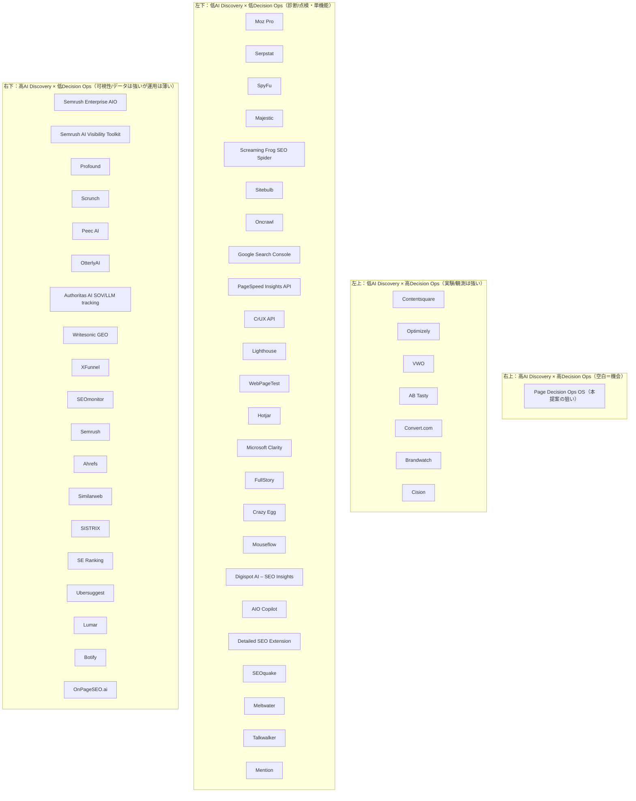
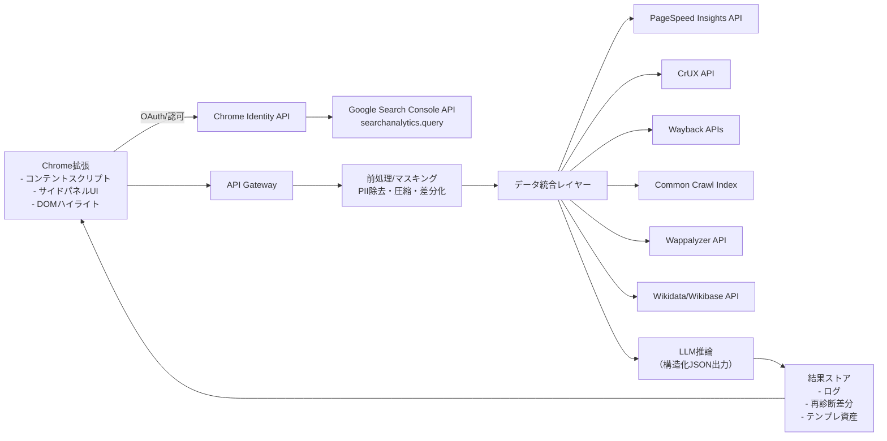
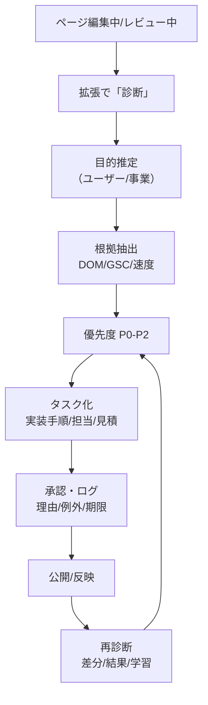
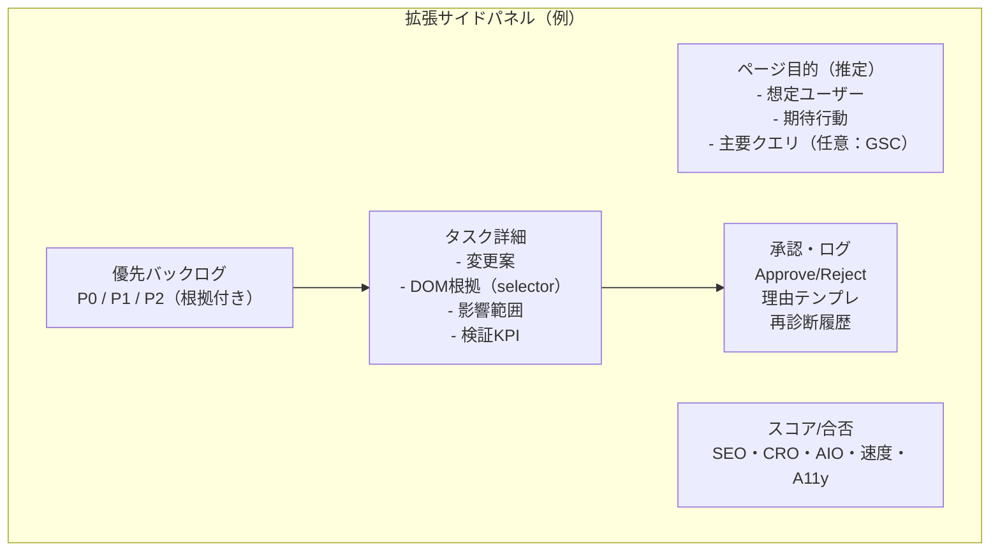

# Page Decision Ops OS ブラウザ拡張プロダクト 深掘り調査報告書

## エグゼクティブサマリ
本件の拡張機能プロダクト（ブラウザ上で“今見ているページ”を起点に、目的起点の提案→根拠→優先度→タスク化→承認・ログ・再診断まで回す）は、既存の「SEO監査」「CRO観測」「AI可視性（AIO/LLMO/GEO）監視」の“間”にある未充足領域、すなわち**ページ単位の意思決定と実装運用（Decision Ops）を標準化するOS**として定義すると、将来のAI Discovery変化に耐える市場ポジションを取り得る。

市場環境の未来性は、Google検索のAI Overviewsが**200+の国・地域、40+言語へ拡大**していることや、Alphabetの公式発言として**AI Overviewsが月間1.5Bユーザー規模**であることから裏付けられる。citeturn1search2turn1search0 さらに、AI Overviewsの拡大が“クリックの分布”を変え得ることを示唆する研究・報道や、AI Overviews周辺に広告が配信されうる公式仕様もあり、発見面（Discovery）の競争は「順位」だけで閉じない方向へ進んでいる。citeturn30search1turn30search2turn30search7

競合状況は、(a) AI可視性/LLM監視（右下：高AI Discovery×低Decision Ops）、(b) CRO実験基盤（左上：低AI Discovery×高Decision Ops）、(c) テクニカルSEO/オンページ診断（左下）に厚く分布し、**右上（高AI Discovery×高Decision Ops）は“空白”**になっている。したがって覇権戦略は、モデル性能よりも「入口（ブラウザ・制作/公開の節目）」「評価基準（Evals）」「ログと再診断」「テンプレ資産化」で“運用標準”を握る設計が最重要となる。

本報告書は、提示要件に沿って、(1)目的・ゴール状態、(2)Issue体系、(3)市場定義と市場規模レンジ、(4)競合50ツール比較と2×2配置、(5)無料API中心のデータ統合、(6)GA4/Ahrefs等有料連携の注意点、(7)MVP要件とアーキ/UX、(8)課金モデル、(9)覇権戦略とリスク対策、(10)残仮説と検証法、(11)優先参照ソース、(12)図表（mermaid）をまとめる。なお、**本セッションには「添付資料」が提供されていないため、チャンネル添付の内部資料統合は未実施**であり、必要なら別途アップロードが必要である。

## 本質的目的とゴール状態
本件の本質は「SEO/CROの助言」そのものではなく、**現場が“次の一手”を確信して決め、実装し、検証し、学びを残すまでの摩擦をページ単位で剥がす**ことにある。AI Discovery（AI Overviews/AI Mode/LLM回答）が拡大するほど、ページ改善は「順位」だけでなく「引用される構造」「語られ方」「信頼根拠」「更新運用」の総合戦になる。citeturn1search2turn1search0turn30search2

ユーザー像別の目的・ゴール状態は、次表のように定義すると要件が曖昧化しにくい。

| ユーザー像 | 本質的目的（Job） | ゴール状態（行動/状態） | 成功指標（例） |
|---|---|---|---|
| 事業会社のサイト/マーケ担当 | 重要ページの改善を“迷いなく”回す | ページを開いて数分で「目的」「優先P0～P2」「根拠」「タスク」「検証」が揃い、関係者承認が通り、再診断で差分が残る | 改善サイクル時間（発見→実装）短縮、CVR/CTR改善、作業工数削減 |
| SEO担当 | クエリ意図とページ構造の不一致を最小化 | GSCのクエリ分布を踏まえて“意図→構造→証拠→内部リンク/スキーマ”をタスク化し、公開前に合否判定 | 主要クエリのCTR/順位安定、インデックス健全性、修正の手戻り減 |
| CRO/LPO担当 | 離脱理由の特定と実験計画を高速化 | 観測（ヒートマップ等）とページ構造から仮説を自動生成し、実験・計測・結果解釈がログ化される | 実験数、勝率、実験1本あたりリードタイム |
| 起業家/少人数チーム | “考える時間”を削って施策実装に寄せたい | ブラウザ上で優先施策が自動で絞られ、実装ガイドと検証設計が出て、学習がテンプレ化される | 施策回転数、工数/人、売上/リード |
| PR/ブランド担当 | “外部でどう語られるか”を整えたい | ブランド主張・根拠・一次情報がページに埋め込まれ、AI/メディア/ソーシャルの叙述のブレが減る | ネガティブ言及低下、語られ方の統一、AI可視性指標（AI SOV等） |

## ユーザー課題の体系化
Issueは「分析できない」ではなく、**認知→判断→実装→検証→運用→導入信頼**の各段階で“止まる”ことに分解できる。AI Overviewsの普及により、従来のSEO指標だけでは説明できない変化が起き得るため（AI Overviewsの拡大は公式に進行中）、課題体系はSEO単体に閉じない設計が必須となる。citeturn1search2turn1search0

| 段階 | 網羅的Issue（代表例） |
|---|---|
| 認知 | ページの目的が曖昧で、誰の何を達成するページかが定義されない。問題点が散在し論点が収束しない。AI/検索/広告/PRなど複数の“発見経路”を同時に見られない。 |
| 判断 | 施策候補が多すぎ、Impact/確度/リスク/工数の比較ができない。根拠が弱く合意が取れない。SEO最適とCRO最適が衝突し意思決定が止まる。 |
| 実装 | 提案が抽象的でタスク化できない。CMS/技術制約を無視して手戻りが多い。実装後に“どこが変わったか”の差分管理がない。 |
| 検証 | KPI/期間/比較方法が未定義で、効いたか判断できない。複数変更が混ざり因果が分からない。GA4など計測設定差で共通指標が揃わない。 |
| 運用 | 改善が一過性で、学びがテンプレ化されず毎回ゼロから議論になる。公開前レビューの標準がなく品質がブレる。AI Discoveryの変化に追随できない。 |
| 導入・信頼 | ページ内容送信に対する機密/プライバシー不安が強い。監査・提案のハルシネーションで信用が落ちる。権限（GSC/GA4）付与が重い。ローカル処理やBYOキーが求められる。citeturn19search1 |

## 市場定義と市場規模レンジ
### 市場定義
未来的に整合する市場は、SEO/CROの部分集合ではなく、**AI Discovery & Page Decision Ops 市場**として定義するのが合理的である。これは「発見（検索順位/AI回答/推薦）→ページの説得（UX/コピー/構造/信頼）→運用（合否・承認・ログ・再診断）」をページ単位で束ねる市場であり、AI Overviewsのような生成検索体験が広がるほど中心になる。citeturn1search2turn1search0turn1search1

この市場の“未来に確実に発生しやすい課題”は、(a) AI回答内での言及/引用/文脈競争（AI SOV等）と、(b) ゼロクリック化の進行による「ページ遷移以前の比較・推薦」の増加、(c) 戦術の増加に伴うレビュー/承認/監査ログ需要（ガバナンス）である。AI Overviewsが200+市場に展開され、広告表示も仕様として位置付けられていることは、Discovery面が継続的に拡張されることを示唆する。citeturn1search2turn30search2

### 市場規模レンジ
単一のTAMを正確に算定するのは難しい（SEO/CRO/DXP/ソーシャル分析などが重複するため）。そこで、本件市場の外縁を構成する“近接カテゴリ”の市場規模を根拠に、レンジとして提示する。

| 近接カテゴリ（本件市場の構成要素） | 市場規模の例 | 出典 |
|---|---:|---|
| SEO software | 2024年 $74.6B → 2030年 $154.6B（推計） | Grand View Research citeturn0search0 |
| Content Intelligence（コンテンツ評価/最適化） | 2022年 $1.15B → 2030年 $10.09B（推計） | Grand View Research citeturn0search1 |
| Digital Experience Platform（DXP） | 2023年 $12.39B → 2030年 $30.41B（推計） | Grand View Research citeturn29search1 |
| Social Media Analytics | 2024年 $10.23B → 2030年 $43.25B（推計） | Grand View Research citeturn29search3 |
| CRO software（定義差あり） | 2023年 $10.4B → 2030年 $23.64B（推計例） | GII/Verified Market Research citeturn29search4 |
| A/B Testing software（参考） | 2024年 $1.16B → 2030年 $2.17B（推計例） | 360iResearch citeturn29search2 |

このため、本件の狙う“実需レンジ”は、狭義（CRO/AB/コンテンツ最適化の交差）なら十億〜数百億ドル規模、広義（SEO softwareを含めた発見・改善運用の外縁）なら**100Bドル級まで接続**し得る。ただし重複が大きいため単純加算は不可であり、現実的には「SEO予算・CRO予算・PR/ブランド予算の“ページ運用に寄る部分”」を奪取する設計が重要となる。citeturn0search0turn29search4turn29search3

## 競合調査とポジショニングマップ
### スコアリング方法
本報告書の2×2は、X軸を**AI Discovery統合度**（検索/GSC/AI回答可視性/引用・競合などの統合度）、Y軸を**Decision Ops度**（提案の優先度化、タスク化、承認/ログ、再診断、実験まで運用として回す度合い）として0〜5で相対評価した。ツールが提供する説明に基づくヒューリスティックであり、実利用で上下し得る（＝「未指定/要検証」となる部分がある）。AI Discoveryへ拡張する競合はすでに増えているため、将来ポジションはXの伸びを前提に設計すべきである。citeturn1search2turn6view0turn24view0

### 50ツール比較表
| カテゴリ                          | ツール                                                                                                                                                       | 主要機能                               | 強み                     | 弱み                       |   X |   Y | 象限                                     |
|:----------------------------------|:-------------------------------------------------------------------------------------------------------------------------------------------------------------|:---------------------------------------|:-------------------------|:---------------------------|----:|----:|:-----------------------------------------|
| AI可視性/AIO・LLMO・GEO           | Semrush Enterprise AIO citeturn6view0 citeturn8view0                                                                                                | LLM/AIプラットフォームでのブランド言及・競合・センチメント計測 | AI可視性を日次で追跡し競合比較まで一体化 | Enterprise前提で高コスト/運用OS度… |   4 |   2 | 右下（高AI Discovery×低Decision Ops）    |
| AI可視性/AIO・LLMO・GEO           | Semrush AI Visibility Toolkit citeturn6view0 citeturn9view0                                                                                         | AIプラットフォーム横断の可視性スコア/プロンプト・競合分析 | 中小でも導入可能なAI可視性の定点観測 | “提案→承認→ログ”の運用機構は薄い |   4 |   2 | 右下（高AI Discovery×低Decision Ops）    |
| AI可視性/AIO・LLMO・GEO           | Profound citeturn5search2                                                                                                                               | AI回答エンジンでの言及/可視性最適化（ゼロクリック対応を標榜） | AI経由の発見を直接KPI化しやすい | ページ実装の承認/ログ/再診断までの標準化は要… |   5 |   2 | 右下（高AI Discovery×低Decision Ops）    |
| AI可視性/AIO・LLMO・GEO           | Scrunch citeturn5search3                                                                                                                                | AI検索でのブランド監視＋サイト最適化＋AIエージェント向け配信 | 『Agent Experience』を含む次世… | 具体的な運用ガバナンス/計測設計は要確認 |   5 |   2 | 右下（高AI Discovery×低Decision Ops）    |
| AI可視性/AIO・LLMO・GEO           | Peec AI citeturn5search0                                                                                                                                | ChatGPT/Perplexity/Claude/Gemini等…    | マーケ向けに可視化とベンチマークが明確 | 『ページ改善タスク化』は別途設計が必要 |   4 |   1 | 右下（高AI Discovery×低Decision Ops）    |
| AI可視性/AIO・LLMO・GEO           | OtterlyAI citeturn23search3 citeturn23search14                                                                                                      | AI検索の監視（ブランド言及・サイト引用・週次レポート等） | AI検索監視を自動化し手作業を削減 | 意思決定OS（承認・ログ・実装チェック）は薄い |   4 |   1 | 右下（高AI Discovery×低Decision Ops）    |
| AI可視性/AIO・LLMO・GEO           | Authoritas AI SOV/LLM tracking citeturn5search1                                                                                                          | Google AI Overviews等を含むAI生成結果でのAI SOV/引用/レスポンス追跡 | AI SOVという新指標を前面にし比較がしやすい | ページ内UX/実装の運用支援は別建てになりやすい |   4 |   1 | 右下（高AI Discovery×低Decision Ops）    |
| AI可視性/AIO・LLMO・GEO           | Writesonic GEO citeturn23search0 citeturn23search1 citeturn23search15                                                                           | AI可視性追跡＋コンテンツ作成/更新（GEO） | 追跡→アクション（生成・刷新）まで一体 | 実装・承認・ログの厳密さは要確認 |   4 |   2 | 右下（高AI Discovery×低Decision Ops）    |
| AI可視性/AIO・LLMO・GEO           | XFunnel citeturn23search2 citeturn8view0                                                                                                            | AI検索でのブランド可視性・引用・質問発見を追跡 | 『獲得への影響』を測ろうとする設計 | 製品定義が変わりやすい新興領域のため要検証 |   4 |   1 | 右下（高AI Discovery×低Decision Ops）    |
| AI可視性/AIO・LLMO・GEO           | SEOmonitor citeturn16search1                                                                                                                            | Google順位＋AI Overviews/ChatGPT等の引用追跡を統合 | 従来SEOとAI検索を同じキーワード戦略で追える | 提案の実装・承認・ログ機構は要確認 |   4 |   2 | 右下（高AI Discovery×低Decision Ops）    |
| SEO統合プラットフォーム           | Semrush citeturn11news41 citeturn6view0                                                                                                             | キーワード/競合/サイト監査等の統合SEO＋AI可視性機能 | 統合データと多機能（AI可視性も同居） | ページ単位の承認・ログ運用は外部化されがち |   4 |   2 | 右下（高AI Discovery×低Decision Ops）    |
| SEO統合プラットフォーム           | Ahrefs citeturn24view0 citeturn4search2                                                                                                             | Site Explorer/Keywords Explorer/Rank Tracker/Site Audit＋Brand Radar等 | 大規模データとBrand RadarでLLM可視性も射程 | プロダクト内で『ページ実装の運用OS』を完結しにくい |   4 |   2 | 右下（高AI Discovery×低Decision Ops）    |
| SEO統合プラットフォーム           | Moz Pro citeturn14news23                                                                                                                                 | キーワード調査/サイト監査/ランクトラッキング等のSEOスイート | 定番指標と学習リソースが豊富 | 本調査環境では公式ページ取得が不安定（仕様要確認） |   2 |   1 | 左下（低AI Discovery×低Decision Ops）    |
| SEO統合プラットフォーム           | Similarweb citeturn11search0 citeturn11search7                                                                                                      | 市場/競合のデジタルデータ・トラフィック推計/インサイト | 市場・競合の俯瞰が強い | ページ改善の具体施策・実装運用は別途 |   3 |   1 | 右下（高AI Discovery×低Decision Ops）    |
| SEO統合プラットフォーム           | SISTRIX citeturn11search1 citeturn11search4                                                                                                         | Visibility Index を中心に順位・可視性を計測 | Visibility Indexという単一指標で定点観測しやすい | ページ改善の実装・運用まで直結しにくい |   3 |   1 | 右下（高AI Discovery×低Decision Ops）    |
| SEO統合プラットフォーム           | SE Ranking citeturn11search2                                                                                                                             | SEOに加えAI Visibility Tracker/AI Overviews Tracker等を掲示 | 従来SEOとAI可視性の同居が明示的 | 承認・ログ・再診断までの運用OSは限定的 |   4 |   2 | 右下（高AI Discovery×低Decision Ops）    |
| SEO統合プラットフォーム           | Serpstat citeturn15search8 citeturn15search0                                                                                                        | キーワード/競合/サイト分析などSEO・コンテンツ向け機能 | 機能範囲が広いSEOスイート | AI検索可視性や運用OSの明示は弱い |   2 |   1 | 左下（低AI Discovery×低Decision Ops）    |
| SEO統合プラットフォーム           | Ubersuggest citeturn15search2                                                                                                                            | キーワード調査/競合分析/サイト監査等（無料枠も訴求） | 導入障壁が低くAI関連の言及もある | 精密な運用ガバナンス/実装チェックは弱い |   3 |   1 | 右下（高AI Discovery×低Decision Ops）    |
| SEO統合プラットフォーム           | SpyFu citeturn15search3 citeturn22news54                                                                                                            | 競合キーワード/広告履歴などPPC×SEOの競合分析 | 競合の過去データとPPC視点が強い | ページ改善の実装運用は外部依存 |   2 |   1 | 左下（低AI Discovery×低Decision Ops）    |
| SEO統合プラットフォーム           | Majestic citeturn16search0                                                                                                                               | 被リンク分析（Trust Flow/Citation Flow等） | 被リンク専業としての深さ | オンページ/UX/運用OSは対象外 |   2 |   1 | 左下（低AI Discovery×低Decision Ops）    |
| テクニカルSEO/性能・UX基盤         | Screaming Frog SEO Spider citeturn17search0                                                                                                              | ローカルクロールでSEO課題検出・大量エクスポート | 手元で高速に構造問題を網羅検出できる | 提案の目的適合・運用（承認/ログ）はユーザー側 |   1 |   1 | 左下（低AI Discovery×低Decision Ops）    |
| テクニカルSEO/性能・UX基盤         | Sitebulb citeturn17search1                                                                                                                               | デスクトップ/クラウドクローラ＋優先度付け（Hints） | 優先度と示唆が組み込みで実務向き | AI Discovery統合や承認ログは限定的 |   1 |   2 | 左下（低AI Discovery×低Decision Ops）    |
| テクニカルSEO/性能・UX基盤         | Lumar citeturn17search2                                                                                                                                 | Tech SEO・GEO・サイト速度・アクセシビリティ等の統合最適化 | 未来の検索（GEO）と性能を統合しやすい | 提案→実装→ログの運用はエンプラ導入設計が前提 |   3 |   2 | 右下（高AI Discovery×低Decision Ops）    |
| テクニカルSEO/性能・UX基盤         | Botify citeturn17search3                                                                                                                                | AI search optimization を掲げるエンタープライズSEOプラットフォーム | 大規模サイト向けの可視性/最適化の枠組み | 製品の具体ワークフローは契約・導入依存 |   3 |   2 | 右下（高AI Discovery×低Decision Ops）    |
| テクニカルSEO/性能・UX基盤         | Oncrawl citeturn18search0 citeturn18search4                                                                                                         | クロール＋ログ分析等で大規模技術SEOデータを提供 | 第三者/ネイティブデータ統合でROIを示しやすい | ページ改善の提案・運用OSは別レイヤー |   2 |   2 | 左下（低AI Discovery×低Decision Ops）    |
| テクニカルSEO/性能・UX基盤         | Google Search Console citeturn18search3 citeturn18search7                                                                                           | 検索パフォーマンス/インデックス状況の公式ツール | 一次データ（検索）として最重要 | 『次の一手』の自動提案や運用OSは提供しない |   2 |   1 | 左下（低AI Discovery×低Decision Ops）    |
| テクニカルSEO/性能・UX基盤         | PageSpeed Insights API citeturn2search1                                                                                                                  | URL単位で性能/改善提案（Lighthouse）と実測UXを返すAPI | 導入が容易で改善項目が構造化されている | CrUX実測データはAPIから除外予定（CrUX API推奨） |   1 |   1 | 左下（低AI Discovery×低Decision Ops）    |
| テクニカルSEO/性能・UX基盤         | CrUX API citeturn2search2                                                                                                                                | 実測UX（フィールド）のCore Web VitalsをURL/Originで取得 | 体感品質を“推測”でなく実測で補正できる | ボリューム不足のサイトでは値が欠落する可能性 |   1 |   0 | 左下（低AI Discovery×低Decision Ops）    |
| テクニカルSEO/性能・UX基盤         | Lighthouse citeturn18search1                                                                                                                             | 性能/アクセシビリティ/SEO等の監査をURL指定で実行 | ローカル実行・CI組み込み等の柔軟性 | 実ユーザー行動や獲得意図の統合は別途 |   1 |   0 | 左下（低AI Discovery×低Decision Ops）    |
| テクニカルSEO/性能・UX基盤         | WebPageTest citeturn18search2                                                                                                                             | 詳細な性能計測をREST APIで統合できる | ネットワーク条件/地域等の再現テストで原因切り分けが強い | SEO/AI可視性や意思決定OSは対象外 |   1 |   0 | 左下（低AI Discovery×低Decision Ops）    |
| CRO/UX観測・実験                  | Hotjar citeturn25search0                                                                                                                                | ヒートマップ/録画/調査等の行動分析 | 導入しやすく“なぜ離脱するか”の質的把握に強い | 検索/AI発見側の統合が弱い |   1 |   1 | 左下（低AI Discovery×低Decision Ops）    |
| CRO/UX観測・実験                  | Microsoft Clarity citeturn25search1                                                                                                                     | 無料のヒートマップ/録画＋AI要約 | 無料で導入できAI要約で観測の負荷を下げる | 実験・承認・ログは別途 |   1 |   1 | 左下（低AI Discovery×低Decision Ops）    |
| CRO/UX観測・実験                  | FullStory citeturn25search2                                                                                                                             | セッションリプレイ＋AI要約等で体験課題を発見 | 深い体験分析と要約で原因探索が速い | 発見（検索/AI回答）統合は別途 |   1 |   2 | 左下（低AI Discovery×低Decision Ops）    |
| CRO/UX観測・実験                  | Contentsquare citeturn25search3                                                                                                                         | Experience Analytics + AIエージェントでインサイト提供 | 企業向けに分析→意思決定を短絡化する機構が強い | 検索/AI可視性とページ実装を一気通貫するには統合が必要 |   1 |   3 | 左上（低AI Discovery×高Decision Ops）    |
| CRO/UX観測・実験                  | Crazy Egg citeturn26search0                                                                                                                              | ヒートマップ/録画/サーベイ/A/Bテスト等 | ページ改善の基本ツールが一通り揃う | 検索/AI Discovery統合は弱い |   1 |   1 | 左下（低AI Discovery×低Decision Ops）    |
| CRO/UX観測・実験                  | Mouseflow citeturn26search1                                                                                                                              | セッションリプレイ/ヒートマップ/行動分析 | 離脱点・摩擦点の発見がしやすい | AI Discovery統合・承認ログは別途 |   1 |   1 | 左下（低AI Discovery×低Decision Ops）    |
| CRO/UX観測・実験                  | Optimizely citeturn26search2                                                                                                                             | 実験・パーソナライズ・分析の統合プラットフォーム | 実装→実験→学習の運用が強い | 『何を優先的に変えるか』の発見は別途データ/人に依存 |   1 |   4 | 左上（低AI Discovery×高Decision Ops）    |
| CRO/UX観測・実験                  | VWO citeturn26search3                                                                                                                                   | A/B/多変量テスト等の実験基盤 | 高速に仮説検証を回せる | AI Discovery統合は限定的 |   1 |   4 | 左上（低AI Discovery×高Decision Ops）    |
| CRO/UX観測・実験                  | AB Tasty citeturn27search0                                                                                                                              | A/Bテスト・パーソナライゼーション等のDXO | ノーコード実験・最適化の運用が強い | 発見（クエリ意図/AI引用）統合は別レイヤー |   1 |   4 | 左上（低AI Discovery×高Decision Ops）    |
| CRO/UX観測・実験                  | Convert.com citeturn27search1 citeturn27search5                                                                                                     | A/Bテスト・パーソナラライゼーション等の実験基盤 | プライバシー配慮のA/Bテストを訴求 | 発見統合・承認ログは自社設計が必要 |   1 |   4 | 左上（低AI Discovery×高Decision Ops）    |
| ブラウザ拡張（直接競合）           | OnPageSEO.ai citeturn19search0 citeturn19search4                                                                                                    | ページ上でSEO診断＋GSC連携＋AI提案 | ブラウザ上で即時にGSC×AI提案を出せる | Decision Ops（承認・ログ・再診断）までの標準は薄い |   3 |   2 | 右下（高AI Discovery×低Decision Ops）    |
| ブラウザ拡張（直接競合）           | Digispot AI – SEO Insights citeturn19search1 citeturn19search5                                                                                     | SEO & AEO監査をページ上に表示、BYO API key可 | privacy-first・オーバーレイ表示・BYOキーで導入摩擦が低い | 目的起点の優先度付け・タスク化は限定的 |   2 |   1 | 左下（低AI Discovery×低Decision Ops）    |
| ブラウザ拡張（直接競合）           | AIO Copilot citeturn19search2 citeturn19search14                                                                                                    | ページ上でAI SEO分析・AIO readiness 等 | AIO（AI Overviews）向けの評価軸を前面に | 承認・ログ・再診断の運用OSには未成熟 |   2 |   1 | 左下（低AI Discovery×低Decision Ops）    |
| ブラウザ拡張（直接競合）           | Detailed SEO Extension citeturn19search3 citeturn19search7                                                                                           | ページのtitle/meta/robots等を即表示するオンページ確認 | 日常のオンページ確認が高速 | 提案生成・運用OSは対象外 |   1 |   0 | 左下（低AI Discovery×低Decision Ops）    |
| ブラウザ拡張（直接競合）           | SEOquake citeturn20search0 citeturn20search2 citeturn20search4                                                                                  | SERP分析・SEO監査・指標表示の無料拡張 | ユーザー数が多く、SERP/オンページ両方を扱う | AI Discovery/運用OSは別途 |   1 |   1 | 左下（低AI Discovery×低Decision Ops）    |
| PR/広報・ブランド監視（隣接競合） | Meltwater citeturn21search0                                                                                                                             | メディア/ソーシャル/消費者インテリジェンス（AI活用を訴求） | 外部言及・評判の定点観測とレポートが強い | ページ実装（HTML/UX）の改善に直結しにくい |   2 |   2 | 左下（低AI Discovery×低Decision Ops）    |
| PR/広報・ブランド監視（隣接競合） | Brandwatch citeturn21search1 citeturn21search9                                                                                                      | 消費者意見アーカイブ＋生成AIでトレンド/意思決定を支援 | ワークフロー/承認/連携の色が強い | 検索/AI引用のページ単位改善には追加統合が必要 |   2 |   3 | 左上（低AI Discovery×高Decision Ops）    |
| PR/広報・ブランド監視（隣接競合） | Talkwalker citeturn21search2 citeturn21search10                                                                                                     | ソーシャルリスニング/メディアモニタリング | 消費者洞察・キャンペーン分析に強い | ページ改善の実装/検証は外部 |   2 |   2 | 左下（低AI Discovery×低Decision Ops）    |
| PR/広報・ブランド監視（隣接競合） | Cision citeturn21search3                                                                                                                                | メディア監視・レポート・ジャーナリストアウトリーチ等 | PR業務の実装（配信/関係構築）まで含む | 検索/AI回答の引用最適化には追加レイヤー |   2 |   3 | 左上（低AI Discovery×高Decision Ops）    |
| PR/広報・ブランド監視（隣接競合） | Mention citeturn22search0 citeturn22search13                                                                                                        | ソーシャルリスニング＆メディアモニタリング | 軽量に導入でき、言及追跡の即応性が高い | ページ改善のタスク化・承認・ログとは別系統 |   2 |   2 | 左下（低AI Discovery×低Decision Ops）    |

### 2×2マップ（mermaid）

### 解釈と、取るべき市場ポジション
上表とマップが示すのは、AI可視性やSEO統合は急速に強化され（Ahrefsは「Brand RadarでLLM可視性」を掲示し、SE RankingもAI可視性トラッカーを前面に出す）、右下が厚くなる一方で、承認・ログ・再診断・テンプレ資産化までを“OS”として握る右上が空白ということだ。citeturn24view0turn11search2turn6view0 よって本件は「提案AI」ではなく、**公開前/改修前の節目に割り込み、合否基準（Evals）とログを標準化する**ことで、既存のあらゆるツールを“下請け”にできる。

## データ統合候補と提案精度への影響
### 無料で使えるAPI/データソース（優先）
本件は「HTMLを読む」だけだと、目的推定と優先度が恣意的になりやすく、根拠が弱くなる。そこで無料〜低コストの一次データ・準一次データを統合し、**提案の再現性（説明可能性）**を上げるのが中核設計となる。

| データ統合候補 | 取得できる情報 | 提案精度・根拠への寄与 | 制約/注意 | 公式根拠 |
|---|---|---|---|---|
| Search Console API（Search Analytics） | ページ×クエリのクリック/表示/CTR/掲載順位、device/country等で集計 | 「流入意図（何で来ているか）」をページ単位で推定し、見出し/導線/FAQ/内部リンクを“クエリに沿って”優先度付けできる | OAuth権限が必要。データ欠損や遅延、ページ正規化（URL正規化）に注意 | citeturn2search0 |
| PageSpeed Insights API | 性能・アクセシビリティ・SEO改善案（Lighthouse）等 | 「体験上の摩擦（速度/CLS等）」を提案に直接反映し、CROとSEOを同時に改善する技術タスクを生成 | PSI内のCrUX実測データはAPIから除外予定で、CrUX API推奨と明記 | citeturn2search1 |
| CrUX API | 実測UX（フィールド）Core Web VitalsをURL/Originで取得 | 提案の“確度”を上げる（ラボで良くても実測が悪い等を補正） | APIキーが必要、トラフィック少のURLはデータ不足になり得る | citeturn2search2 |
| Lighthouse | 性能/アクセシビリティ/SEO監査 | CI・公開前レビューに組み込みやすく、合否基準（Evals）を作りやすい | Discovery（検索/AI回答）との接続は別途 | citeturn18search1 |
| WebPageTest API | 詳細な性能テスト（地点/環境） | “原因切り分け”と改善優先度を精密化（CDN/画像/TTFB等） | 設定項目が多く、MVPではPSI優先が現実的 | citeturn18search2 |
| Common Crawl（Index/データ） | 公開Webのクロールデータ・URLインデックス | 競合/引用元の“Web上の実在”や、過去の構造・差分補助（とくに大規模調査） | データ量が大きく、設計を誤るとコスト/遅延が増える | citeturn3search1turn3search5 |
| Wayback Machine API | 過去キャプチャ（差分/反復） | 「いつ何を変えたか」を客観化し、再診断の差分説明・学習に使える | キャプチャが無い/偏りがある。利用規約・頻度配慮 | citeturn3search0 |
| Wappalyzer API | CMS/フレームワーク等の技術スタック | 「実装可能な打ち手」を現実化（WordPressならブロック、Shopifyならテーマ等） | 精度はサイトにより差。APIは有料プラン要素があり得る | citeturn3search2 |
| Chrome拡張 OAuth（Identity API） | GSC等のOAuthを拡張から実施 | “GSC連携”を拡張UXとして成立させる基盤。拡張は通常のOAuth制約がありChrome Identity API依存と説明 | 認証フロー/権限設計が複雑化するためMVPは段階導入推奨 | citeturn2search3 |
| Wikidata/Wikibase API | エンティティ同定（企業/人物/製品） | 構造化/エンティティ整備の提案（AI回答で引用されやすい一次情報設計）に寄与 | 品質はエンティティ依存、同名曖昧性の解決が必要 | citeturn28search0 |
| Crossref REST API / OpenAlex API | 論文・一次資料メタデータ | “根拠リンク”の補強（E-E-A-T/一次情報）提案の質を上げる | レート制限や利用作法、分野偏りに注意 | citeturn28search2turn28search3 |

### 提案精度を上げる実務的な統合順序
MVPでの実装順序は、(1)HTML/DOC構造＋(2)GSC（意図）＋(3)PSI/Lighthouse（摩擦）＋(4)CrUX（実測補正）＋(5)Wayback（差分/学習）を基本線とし、Common Crawlや学術APIは「高度な根拠強化・競合深掘り」へ段階導入するのがリスクが低い。PSIはCrUX実測データを含める運用が将来継続しない旨が明記されているため、CrUX APIを別立てにする設計が長期的に安全である。citeturn2search1turn2search2

## 有料連携の利点・制約・実装上の注意点
### GA4連携
GA4連携の価値は「検証フェーズ」を強化できる点にある一方、あなたが懸念した通り、サイトごとに**コンバージョン（Key event/Conversion）の定義が異なる**ため、“誰でも同じ価値”を損なうリスクがある。GA4 Admin APIにはキーイベント（KeyEvent）という概念があり、デフォルトイベントかカスタムイベントかを示すフィールドも存在するため、プロダクト側は「キーイベント一覧を取得→ユーザーに選ばせる→検証テンプレに反映」という設計が現実的である。citeturn4search4turn4search0

実装面では、データ取得はGA4 Data API（レポートデータ）で行い、設定・イベント定義の把握はAdmin API（キーイベント）で補完する二段構えが基本となる。citeturn3search3turn4search4 ただしMVPでは「GA4なしでも成立」させ、GA4はチーム/上位プランでオプション化するのが、導入摩擦と汎用性の観点で合理的である。

### Ahrefs等の有料SEOデータ連携
AhrefsはAPI v3が**Enterpriseプランで利用可能**で、Site Explorer/Keywords Explorer/Site Audit/Rank Tracker/Brand Radarなどのエンドポイントを提供すると説明している。citeturn4search2turn4search3 これは「競合比較」「被リンク健全性」「クエリ難易度期待」「AIエージェントの引用傾向（Brand Radar系）」の根拠を強化し得るが、コストが高く、導入も重い。

実装上の現実解は、Digispotが掲げるような**BYOキー（Bring Your Own API key）**の選択肢を用意し、(a) ユーザーが自社のAhrefs/他APIキーを入力して直接課金されるプラン、(b) あなた側がキーを持ち従量課金に含めるプラン、を併存させることだ。citeturn19search1turn4search2 なおAhrefs自体もAPI v3への移行を明示しており、新規統合はv3前提で設計する必要がある。citeturn4search7turn4search2

## MVP要件・技術アーキテクチャ・UXフロー
### MVP要件
MVPでは「右上（高AI Discovery×高Decision Ops）」の楔を打つために、機能量よりも**運用の型（節目・合否・ログ・再診断）**を先に確立する。

| 優先度 | 要件（Must/Should/Could） | 実装意図 |
|---|---|---|
| Must | ページDOM/本文/見出し/リンク/フォーム要素を取得し、目的推定→課題→根拠（DOM参照）→優先度（P0-P2）→タスク化（実装手順）までをJSONで返す | 提案を“実装可能なタスク”に落とす |
| Must | GSC連携（任意）でページ×クエリを取得し、「想定ニーズ/意図」と優先タスクを更新 | 目的推定の確度を上げ、SEO/CROを統合する citeturn2search0 |
| Must | 公開前レビューUX（例：編集/公開ボタン前の“診断→合否→承認”）と、再診断（差分） | Decision Opsの入口を固定し、継続利用を作る |
| Must | ログ（誰が何を承認/却下し、なぜそうしたか）と、タスクの状態管理（未着手/進行/完了） | 学習の資産化と説明責任（監査） |
| Should | PSI/Lighthouse統合で性能・アクセシビリティ・SEO監査を付与 | 技術改善を“根拠付きタスク”に変換 citeturn2search1turn18search1 |
| Should | Wayback/CDXで変更履歴の参照、再診断差分の説明補助 | 再現性と差分レビューを強化 citeturn3search0 |
| Should | BYOキー（OpenAI/Claude/Gemini等）を用意し、AI推論部分のコストと機密をユーザー側で制御 | 導入障壁と原価リスクを下げる citeturn19search1 |
| Could | AIO/LLMO可視性（OtterlyAI等）やAhrefs連携で、AI引用/競合優位を補強 | 上位プランの差別化 citeturn23search3turn4search2 |
| Could | チーム向け：Slack/Jira/Notion連携、承認フローのカスタム | 大企業導入に必要な運用統合 |

### 技術アーキテクチャ概要
拡張機能でOAuthを扱う場合、拡張は通常のWebアプリと同様に動けない制約があり、Chrome Identity API等を使うチュートリアルが提供されている。citeturn2search3 その上で、アーキテクチャは「拡張（UI/収集）＋サーバー（統合/キャッシュ/課金）＋LLM（推論）」の分離がコスト・セキュリティ・運用の観点で妥当となる。

### UXフロー（公開前レビューを節目にする例）
公開前レビューを「節目」として固定すると、ユーザーは“いま何をすべきか”を迷いにくく、品質も揃う。加えて、PSI/Lighthouseのような監査はURL単位で実行でき、公開前チェックの自動化に馴染む。citeturn18search1turn2search1

### MVP画面ワイヤー（簡易）

## 課金モデル案と覇権戦略
### 課金モデル案
「1日1ページ無料→以降課金」は、導入障壁を下げつつ“継続利用”へ接続しやすい。従量の単位は「分析ページ数」だけでなく、「外部APIコール」「LLMトークン」「再診断/差分」も実原価に連動するため、**クレジット制**が設計しやすい。

| プラン | 価格・課金単位（例） | 含める価値 | 備考 |
|---|---|---|---|
| Free | 1日1ページ分析（固定） | 目的推定、P0-P2、DOM根拠、簡易ログ | サーバー原価を抑えるためLLMは軽量/回数制限 |
| 従量（クレジット） | 追加分析＝Nクレジット、再診断＝Mクレジット | 分析回数増・差分比較・エクスポート | PSI/CrUX等の無料APIは基本含めやすい citeturn2search1turn2search2 |
| BYOキー | 月額低め＋ユーザーがLLM/有料データAPIキーを入力 | 機密/コストをユーザー側で制御 | BYOキー訴求は既存拡張でも見られる citeturn19search1 |
| Team | シート＋監査ログ＋承認フロー＋共有テンプレ | チーム運用（Decision Ops）を商品化 | 監査ログ・権限が差別化ポイント |
| Enterprise | SSO/監査/カスタムEvals/オンプレ/データ保持 | 大企業導入・法務/セキュリティ対応 | Ahrefs等はEnterprise限定が多い citeturn4search3turn4search2 |

### 覇権戦略
覇権（デファクト標準）を握る鍵は、AIモデルの賢さではなく、**入口支配と評価基準の標準化**である。Google検索のAI Overviewsが拡大し（200+市場、1.5B規模）、広告配置も仕様化されるほど、発見の競争は複雑化し続ける。citeturn1search2turn1search0turn30search2 そのとき勝つのは、次の3点を“運用の道具立て”として提供するプレイヤーである。

入口支配は、ブラウザ上で「公開前」「改修前」「レビュー前」という節目に割り込むことで成立する。評価基準の標準化は、Lighthouse/PSIの監査結果やGSCの意図データを“合格/不合格”の型に落とし、誰が見ても同じ判断になる状態を作ることによって成立する。citeturn18search1turn2search0turn2search1 テンプレ資産化は、承認ログと再診断差分（Waybackなど）を蓄積し、勝ちパターンをテンプレとして再利用できるようにすることでネットワーク効果（“使うほど賢くなる運用知”）を生む。citeturn3search0

### リスク対策（要点）
プライバシーは最大リスクであり、Digispotのように「ローカル実行」「任意でAI」「BYOキー」「トラッキングなし」を前面に出す競合が存在する以上、最初から“送信範囲の可視化・マスキング・ローカルモード”を設計に含める必要がある。citeturn19search1 またPSI/CrUXのようにAPI仕様が変わり得るため（PSIでCrUX実測取り込み停止予定が明記）、依存点を分離し差し替え可能にすることが長期安定に直結する。citeturn2search1turn2search2

## 未解決の残論点と優先検証仮説
以下は、現時点で論証が不足しやすい（＝失敗要因になり得る）仮説と、その検証方法・成功基準である。

| 仮説（優先順） | なぜ重要か | 検証方法（最短） | 成功基準（例） |
|---|---|---|---|
| 「目的推定」はユーザーに受け入れられる（外さない） | 目的推定が外れると提案全体が崩れる | 10業種×各5ページで、推定目的とユーザー評価（正しい/微修正/不正）を計測 | 正しい＋微修正が80%以上、致命的外しが10%未満 |
| P0〜P2の優先度が実装に直結する | “提案止まり”を脱する条件 | 提案→タスク化→実装完了までの到達率を、拡張なし/ありで比較 | 実装到達率が2倍、またはリードタイム30%短縮 |
| GSC統合が価値を劇的に上げる | API権限付与の摩擦を正当化できるか | GSCなし/ありで提案採用率、納得度（根拠十分）をAB | 採用率+20pt、納得度平均+1以上（5段階） citeturn2search0 |
| GA4はMVPでなくても成立する | 設定差で汎用価値が壊れる懸念 | GA4連携なしでも、検証テンプレ（PSI/CrUX/クリック導線等）で改善が回るか | GA4なしのユーザー継続率（4週）>30% |
| 右上（高Discovery×高Ops）の“空白”は本当に空白 | エンプラが内製している可能性 | 主要エンプラ（SEO/CRO/PR）導入企業10社に「現行運用」をヒアリング | 既存ツールで完結できていない率>60% |
| BYOキーが課金導線として成立する | 原価と機密リスクを抑える核施策 | BYOキー設定率、継続率、LTVを計測 | BYOキー設定率>20%、継続率が非BYOより高い citeturn19search1 |

## 優先的に参照すべきソース一覧
一次・公式を最優先とし、必要箇所のみ業界記事/レポートを補助に使うのが望ましい。

| 優先 | ソース | 参照理由 |
|---|---|---|
| 最高 | Alphabet Investor Relations（Q1 2025 Earnings Call） | AI Overviews利用規模など、検索のAI化を公式発言で裏取りできる citeturn1search0 |
| 最高 | Google公式ブログ（AI Overviews拡大） | 200+市場/40+言語など、AI Overviewsの展開状況を一次情報で確認 citeturn1search2 |
| 最高 | Google Developers（Search Console API / PSI / CrUX） | GSC/PSI/CrUXの公式仕様、将来変更点（PSIのCrUX停止予定）を把握 citeturn2search0turn2search1turn2search2 |
| 最高 | Chrome Developers（OAuth/Identity API） | 拡張からのOAuth実装の公式手順・制約の確認 citeturn2search3 |
| 高 | Ahrefs公式（サイト/API docs） | LLM可視性（Brand Radar）やAPI可用性（Enterprise限定）を一次情報で把握 citeturn24view0turn4search2turn4search3 |
| 高 | GA4公式（Data API / Admin KeyEvent） | “計測設定差”を扱うための公式概念（KeyEvent/Custom）を把握 citeturn3search3turn4search4 |
| 高 | Wayback API / Common Crawl / Wappalyzer API | 無料〜準無料データ源として、差分/競合/技術制約推定を支える citeturn3search0turn3search1turn3search2 |
| 中 | Grand View Research 等の市場レポート | 市場レンジの根拠（SEO/CRO/DXP等）を外部推計で裏取り citeturn0search0turn0search1turn29search1turn29search4 |
| 中 | Semrush（LLM monitoring tools記事） | AIO/LLM可視性カテゴリの整理と主要プレイヤーの把握（公式ブログ） citeturn6view0turn8view0 |
| 補助 | 日本語の業界記事（例：Digiday日本版） | “ゼロクリック化”など国内読者向けの理解補助（一次ではない） citeturn30search7 |

